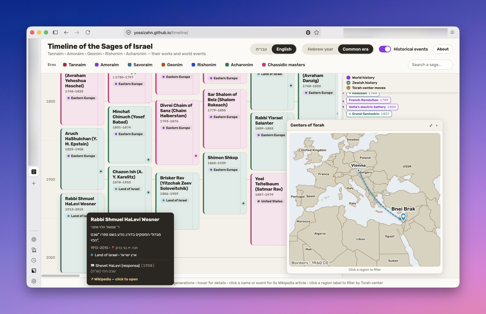

# Timeline of the Sages of Israel

An interactive, vertical, right-to-left timeline of the sages of Israel —
**Tannaim · Amoraim · Savoraim · Geonim · Rishonim · Acharonim** (and the
Chassidic masters) — alongside their major works and the world and Jewish
history unfolding around them. Hover a sage to see details and watch the era's
political borders and "centers of Torah" light up on the map.

**Live:** <https://yossizahn.github.io/timeline/>



## Features

- Vertical timeline with global lane-packing so every generation stays readable.
- Hebrew (RTL) and English UI, with Hebrew or Common-era years.
- A floating, resizable, draggable world map that drops a city pin and paints
  the era's borders for whichever sage you hover.
- World events, inner-Jewish history, and Torah-center migrations on a side rail.
- Region filtering and direct links to each figure's Wikipedia article.

## Running locally

It's a **static site with no build step** — just serve the folder:

```sh
python3 -m http.server 4178
```

Then open <http://localhost:4178/>. (Use a server rather than opening
`index.html` directly, since scripts load via relative paths.)

## A note on how this was built

All of this project (including this README) was **vibe coded** — built conversationally with an AI coding
assistant (Mostly Claude Opus 4.8) rather than hand-architected up front. Expect the occasional rough
edge, and please don't treat the structure as gospel.

## Contributing

Issues and pull requests are very welcome — corrections to dates, names, or
Wikipedia links, new figures and events, or fixes to anything that looks off.
Open an [issue](https://github.com/yossizahn/timeline/issues) or send a PR.
